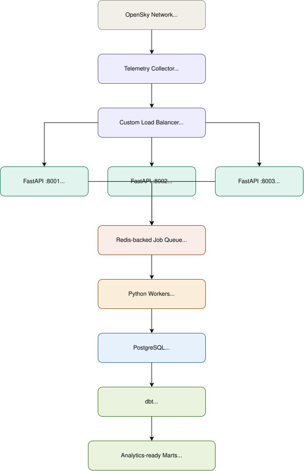

# FlightPulse

### A Production-Inspired Aviation Telemetry ETL & Analytics Pipeline

FlightPulse ingests live aircraft telemetry from the **OpenSky Network**,
pushes it through a custom load balancer and an asyncio-native job queue,
persists it idempotently in PostgreSQL, transforms it with dbt into
analytics-ready marts, and has been load- and fault-tested end to end.

**Core stack:** Python · FastAPI · PostgreSQL · Redis · `arq` (asyncio-native
job queue) · dbt · a hand-built round-robin load balancer · Docker Compose.

Full design references (this README is kept in sync with both — the
continuation doc governs for Phase 5+ where they disagree):
- [`FlightPulse_Complete_Project_Workflow_Guide.pdf`](./FlightPulse_Complete_Project_Workflow_Guide.pdf) — Phases 1–4 technical spec
- [`FlightPulse_Phase5_Continuation_ETL_Business_Objectives.pdf`](./FlightPulse_Phase5_Continuation_ETL_Business_Objectives.pdf) — Phase 5+ ETL spec, business objectives, data-quality rules, KPIs

---

## Navigation / Quick Access

Jump to the section you need:

- [Overview](#overview)
- [Project Goal](#project-goal)
- [Data Architecture](#data-architecture)
- [Repository Structure](#repository-structure)
- [Data Layer Outputs (dbt marts)](#data-layer-outputs-dbt-marts)
- [Build Status by Phase](#build-status-by-phase)
- [How to Reproduce](#how-to-reproduce)
  1. [Prerequisites](#1-prerequisites)
  2. [Clone & configure](#2-clone--configure)
  3. [Start PostgreSQL & Redis](#3-start-postgresql--redis)
  4. [Run the ingestion tier + load balancer](#4-run-the-ingestion-tier--load-balancer)
  5. [Run the async workers](#5-run-the-async-workers)
  6. [Run the collector (pull live OpenSky data)](#6-run-the-collector-pull-live-opensky-data)
  7. [Run dbt (staging → marts)](#7-run-dbt-staging--marts)
  8. [Run the Phase 7 load & resilience tests](#8-run-the-phase-7-load--resilience-tests)
- [Verifying the Pipeline Is Healthy](#verifying-the-pipeline-is-healthy)
- [Known Gotchas](#known-gotchas)
- [Deliberate Deviations from the Docs](#deliberate-deviations-from-the-docs)
- [Contact](#contact)

---

## Overview

This project simulates a real production telemetry platform end to end: a
live external data source, a fault-tolerant ingestion tier sitting behind a
custom load balancer, an asynchronous durable job queue, idempotent
persistence, and a dbt-modeled analytics layer — then it deliberately
breaks each piece (killed processes, killed workers, a killed Redis
instance) to prove the system degrades safely and recovers on its own.

Live aircraft state vectors are pulled from OpenSky's `/states/all`
endpoint every 30 seconds, normalized into a canonical event schema, and
sent as batches through a round-robin load balancer to one of three
FastAPI ingestion instances. Each accepted batch becomes a single `arq`
job; workers validate, deduplicate, and persist it into PostgreSQL with
deterministic, idempotent keys so redelivered or duplicated data never
double-counts. dbt then turns that raw table into staging, intermediate,
and mart-level models that answer the project's actual business
questions.

## Project Goal

Per `FlightPulse_Phase5_Continuation_ETL_Business_Objectives.pdf`, §1:

> Transform aviation telemetry from OpenSky Network into reliable,
> near-real-time operational intelligence that can be used to understand
> aircraft activity, airspace utilization, flight movement patterns, and
> changes in aviation traffic over time.

Concretely, the pipeline is built to answer (continuation doc §2):

- Aircraft counts by time period, and regional/geographic density
- Activity trends by hour and by day
- Most frequent aircraft / callsigns
- Altitude and velocity patterns, and climb / descend / stable activity
- Telemetry freshness and duplicate/invalid rates
- System behavior under load and under component failure

Phases 1–5 exist purely to get clean, deduplicated, traceable data into
PostgreSQL reliably enough that the Phase 6 dbt marts answering those
questions can actually be trusted. Phase 7 exists to prove the pipeline
keeps answering them correctly even when something breaks.

## Data Architecture
 


**Why each hop exists:**

| Hop | Purpose |
|---|---|
| Collector | Pulls live data, normalizes it into one canonical schema, builds a deterministic idempotency key per observation |
| Load balancer | Distributes traffic across 3 backends, detects and routes around a dead backend immediately, retries safely-idempotent requests |
| FastAPI ingestion | Validates the batch shape, enqueues one compact job per batch, never touches Postgres directly |
| Redis + `arq` | Durable job queue — a batch survives an ingestion-process crash once it's enqueued |
| Worker | Validates, drops in-batch duplicates, retries transient failures with backoff, dead-letters unrecoverable payloads, persists with `ON CONFLICT DO NOTHING` |
| PostgreSQL | Source-of-truth raw storage — `raw_telemetry` (events) + `extraction_log` (one row per poll cycle, success or failure) |
| dbt | Turns raw JSONB payloads into typed, business-ready marts |

## Repository Structure

```
FlightPulse/
├── collector/          # OpenSky client, event normalizer, batch producer
│   ├── opensky_client.py
│   ├── normalizer.py
│   └── producer.py
├── load_balancer/      # Custom round-robin + health-check reverse proxy
│   ├── config.py
│   ├── router.py
│   ├── health.py
│   ├── metrics.py
│   └── server.py
├── ingestion/           # FastAPI ingestion service
│   ├── app.py
│   ├── routes.py
│   └── schemas.py
├── worker/              # arq queue consumers, processors, persistence
│   ├── consumer.py
│   ├── processor.py
│   ├── persistence.py
│   └── settings.py
├── dbt/                 # staging / intermediate / mart models + tests
│   ├── models/staging/
│   ├── models/marts/
│   └── dbt_project.yml
├── sql/                 # raw table migrations (001–004)
├── replay/              # Phase 7: fixture export, replay engine,
│   │                    #          KPI report, fault injection
│   └── fixtures/
├── tests/
├── docker-compose.yml
└── .env.example
```

## Data Layer Outputs (dbt marts)

The Gold-equivalent layer of this pipeline — the tables everything else
is built to feed:

| Model | Grain | Answers |
|---|---|---|
| `dim_aircraft` | one row per `icao24` | Most-recent callsign/origin country, first/last-seen bounds, observation count |
| `fact_aircraft_state` | one row per telemetry observation | Full observation detail, joins to `dim_aircraft` |
| `mart_aircraft_activity` | `(icao24, observation_date, observation_hour)` | Aircraft counts, activity by hour/day, most-frequent callsigns, altitude/velocity, climb/descend/stable |
| `mart_airspace_activity` | 1°×1° lat/lon grid cell × time | Regional/geographic density and activity trends |
| `mart_telemetry_quality` | `(observation_date, observation_hour)` | Freshness (`telemetry_age_seconds`), duplicate rate, invalid-record rate |

dbt's own test pass rate lives in dbt's `run_results.json`, not in a
mart — see [Phase 7 KPI reporting](#8-run-the-phase-7-load--resilience-tests).

## Build Status by Phase

| Phase | Status |
|---|---|
| 1 — Foundation (repo, Docker Compose, raw schema, minimal FastAPI) | ✅ Complete |
| 2 — OpenSky collector | ✅ Complete |
| 3 — Load balancer (round-robin → health-aware → retry/idempotency → metrics) | ✅ Complete |
| 4 — Async job queue (`arq`) | ✅ Complete |
| 5 — Persistence (idempotent batched inserts, extraction log) | ✅ Complete |
| 6 — dbt (staging → intermediate → marts) | ✅ Complete |
| 7 — Load & resilience testing | ✅ Complete (4.4 deliberately skipped — environment limitation, see below) |
| 8 — Analytics layer | ⬜ Not started |

Full per-step detail for every phase (what was built, how it was verified
live, and every documented gotcha) lives in [`PHASE_LOG.md`](./PHASE_LOG.md).
This README stays focused on **what the system is and how to run it**;
the phase-by-phase build history is kept separately so this file doesn't
grow unbounded as later phases are added.

---

## How to Reproduce

### 1. Prerequisites

- Python 3.11+
- Docker + Docker Compose (or native PostgreSQL 14+ and Redis 6+)
- `psql` client (to spot-check data)
- An [OpenSky Network](https://opensky-network.org/) account — optional,
  but authenticated mode gets you materially higher rate limits
- Windows users: Git Bash is the primary shell for this project; a WSL2
  Ubuntu environment is only needed if you want to run Redis natively via
  `systemd` for Phase 7's redis-failure test (see [Known Gotchas](#known-gotchas))

### 2. Clone & configure

```bash
git clone https://github.com/richmond070/FlightPulse.git
cd FlightPulse

cp .env.example .env
# edit .env: set DATABASE_URL, REDIS_URL, and optionally
# OPENSKY_CLIENT_ID / OPENSKY_CLIENT_SECRET for authenticated OpenSky access

python -m venv .venv
source .venv/bin/activate        # Windows Git Bash: source .venv/Scripts/activate
pip install -r requirements.txt
```

### 3. Start PostgreSQL & Redis

```bash
docker compose up -d postgres redis
```

Apply the raw schema migrations (`sql/001`–`004`) against the running
Postgres instance per your usual migration workflow before continuing.

### 4. Run the ingestion tier + load balancer

The load balancer round-robins across three FastAPI instances — start
all three before the balancer:

```bash
# terminal 1
uvicorn ingestion.app:app --host 0.0.0.0 --port 8001 --reload
# terminal 2
uvicorn ingestion.app:app --host 0.0.0.0 --port 8002 --reload
# terminal 3
uvicorn ingestion.app:app --host 0.0.0.0 --port 8003 --reload

# terminal 4 — the load balancer; the only component anything else talks to
python -m load_balancer.server
```

Verify **through the load balancer**, not a single backend directly:

```bash
curl http://localhost:8080/health
curl http://localhost:8080/version
```

Repeated requests should rotate across `:8001`/`:8002`/`:8003` in the
load balancer's logs.

### 5. Run the async workers

Requires Redis + PostgreSQL running and `DATABASE_URL`/`REDIS_URL` set in
`.env`.

```bash
# terminal 5 (run at least 2 instances of this in separate terminals —
# several Phase 7 fault-injection scenarios require a surviving worker)
export PYTHONPATH=$(pwd)
arq worker.consumer.WorkerSettings
```

**Windows note:** if you hit
`Psycopg cannot use the 'ProactorEventLoop' to run in async mode`, this
is already handled in `worker/consumer.py` via
`asyncio.set_event_loop_policy(asyncio.WindowsSelectorEventLoopPolicy())`.
Confirm you're on the current file if you still see it.

### 6. Run the collector (pull live OpenSky data)

With steps 4 and 5 running, in a new terminal:

```bash
python -m collector.producer
```

This polls OpenSky's `/states/all` every `POLL_INTERVAL_SECONDS` (default
30s), normalizes each state vector, and POSTs batches to
`TELEMETRY_TARGET_URL` (the load balancer, `http://localhost:8080/telemetry`).

- **Anonymous mode:** leave `OPENSKY_CLIENT_ID`/`OPENSKY_CLIENT_SECRET`
  blank — works, but with materially lower rate limits.
- **Authenticated mode:** set both from an API client created on your
  OpenSky account page. Token fetch/refresh (tokens last ~30 min) and
  401 retry-once handling are automatic.

### 7. Run dbt (staging → marts)

```bash
export DBT_PROFILES_DIR=dbt   # avoids passing --profiles-dir every time
cd dbt

dbt debug --project-dir .     # should report "Connection test: OK"
dbt run --project-dir .
dbt test --project-dir .
```

Spot-check a mart:

```bash
psql -U flightpulse -h localhost -d flightpulse \
  -c "SELECT * FROM public_marts.mart_aircraft_activity ORDER BY observation_date DESC LIMIT 5;"
```

(dbt prefixes each model's `+schema:` config onto your profile's base
schema — e.g. `public_staging`, `public_intermediate`, `public_marts`.)

### 8. Run the Phase 7 load & resilience tests

Requires the **full stack** running: Postgres, Redis, all three ingestion
backends, the load balancer, and ≥2 `arq` workers.

```bash
export PYTHONPATH=$(pwd)

# Export a fixture from real raw_telemetry, then replay it at a controlled rate
python -m replay.export_fixture
python -m replay.player --mode fresh --concurrency 3
python -m replay.report        # pulls every §11 KPI from its source of truth

# Fault injection — one scenario at a time
python -m replay.fault_injection single-api-failure --backend-port 8002
python -m replay.fault_injection worker-failure
python -m replay.fault_injection redis-failure --method docker    # Redis in Docker
python -m replay.fault_injection redis-failure --method systemd   # Redis via systemd/WSL2
```

Results and known findings for each scenario (4.1–4.4) are logged in
[`PHASE_LOG.md`](./PHASE_LOG.md#phase-7).

---

## Verifying the Pipeline Is Healthy

| Check | Command |
|---|---|
| Load balancer up, routing correctly | `curl http://localhost:8080/health` |
| Load balancer KPIs | `curl http://localhost:8080/lb-metrics` |
| Backend health states | `curl http://localhost:8080/lb-status` |
| Raw rows landing | `psql ... -c "SELECT count(*) FROM raw_telemetry;"` |
| Worker throughput | Worker log shows e.g. `Persisted batch: 10423 event(s) submitted, 10423 newly inserted, 0 skipped as duplicate (14.8s elapsed, 704 records/sec)` |
| dbt test pass rate | `dbt/target/run_results.json` after `dbt test` |
| End-to-end freshness / duplicate / invalid rate | Query `mart_telemetry_quality` |

## Known Gotchas

- **Windows TCP port rebind delay.** After a hard process kill
  (`SIGKILL`), Windows can hold a TCP port in a lingering state for
  30–60s before a new process can bind it. This shows up as a longer
  recovery time in the single-API-failure fault test — it's an OS-level
  delay, not a load-balancer bug.
- **WSL2 Redis + Windows-native everything else.** If Redis runs as a
  native `systemd` service inside WSL2 while everything else runs
  natively on Windows, run `fault_injection.py` itself from **Windows**
  (Git Bash), not from inside WSL — WSL2's `localhost` is a separate
  network namespace and can't reach the Windows-hosted stack.
  `redis-failure --method systemd` handles this by shelling out to
  `wsl.exe sudo systemctl stop/start redis-server` from Windows. Requires
  passwordless sudo scoped to just those two commands:

  ```bash
  # inside WSL, one-time setup
  sudo visudo -f /etc/sudoers.d/flightpulse-redis-control
  # add: youruser ALL=(ALL) NOPASSWD: /usr/bin/systemctl stop redis-server, /usr/bin/systemctl start redis-server
  sudo chmod 440 /etc/sudoers.d/flightpulse-redis-control
  ```
- **Stale `.env` values silently override code.** If a timeout or
  retry setting seems wrong, check `.env` for a stale override before
  debugging the code itself.

## Deliberate Deviations from the Docs

Documented here so the source PDFs and the actual codebase don't
silently drift apart.

**Async queue: `arq` instead of BullMQ.** Both source docs name
BullMQ + Redis. BullMQ is a Node.js library; this project is kept pure
Python, which the original guide's §8 explicitly permits ("if keeping
the project entirely Python is more important, replace BullMQ with a
Python-native queue"). `arq` was chosen over Celery/RQ/Dramatiq for
being asyncio-native (matches FastAPI's async handlers) and Redis-backed
(no extra broker). Every behavioral requirement either doc specifies —
retries, exponential backoff, bounded attempts, dead-lettering,
concurrent worker processing, idempotent writes — is implemented and
verified live regardless of which library provides the mechanism.

**Idempotency key: deterministic hash, not a random UUID.** The Phase 5
continuation doc's §5.2 warns against assuming every polling response is
unique. `collector/normalizer.py` derives `ingestion_id` via
`uuid5(source + icao24 + last_contact)`, so the same real-world
observation always produces the same id no matter how many times it's
polled or a job is redelivered.

## Contact

Issues, questions, or ideas for Phase 8 — open an issue on
[richmond070/FlightPulse](https://github.com/richmond070/FlightPulse) or
reach out directly.